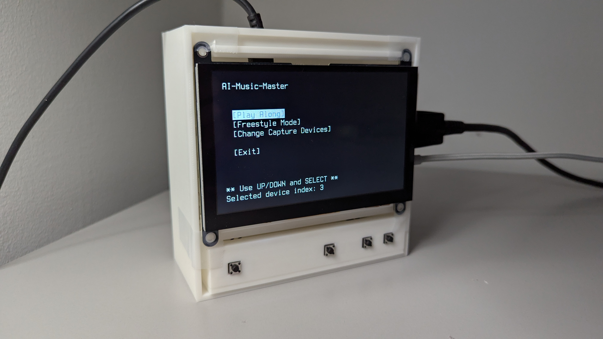
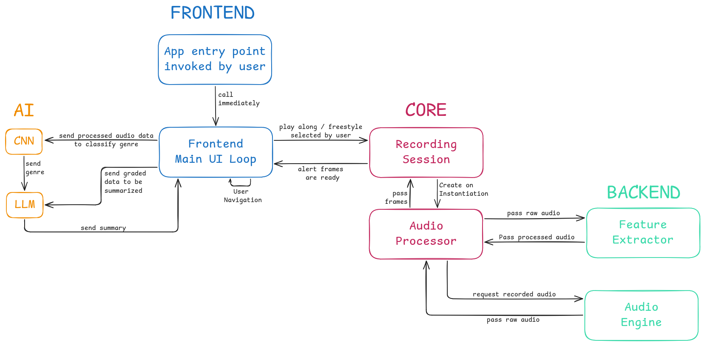

# AI Music Master 🎸

AI Music Master (a very original name, we know) is an embedded system designed to help aspiring guitarists bridge the gap between practice and performance. By providing real-time grading feedback and genre insights, standard practice sessions are transformed into an interactive learning experience.

<center><small>"If it moves and it shouldn't, use duct tape. . ."</small></center>

While Music Master functions as a standalone desktop application, it was developed with portability in mind. Built to live inside a guitar case, the system leverages a Raspberry Pi 5 and a custom hardware integration to deliver high-performance processing in a low-power environment.


## Contents

* [Overview](#ai-music-master-)
* [Contents](#contents)
* [Tech Stack](#tech-stack)
    * [AI](#ai--analysis)
    * [Backend](#backend--digital-signal-processing)
    * [Frontend](#frontend--ui)
    * [Hardware](#hardware--os)
* [Getting Started](#getting-started)
    * [Unix (Linux/macOS)](#unix-linuxmacos)
    * [Windows](#windows)
* [License](#license)
* [Acknowledgments](#acknowledgments)
* [Extras](#extras)


## Tech Stack

<div>
	<code></code>
	<code></code>
	<code></code>
	<code></code>
</div>

### Hardware & OS

Due to the portability constraints of the hardware, the environment was stripped of all non-essential services. This ensures that the application has access to required resources when they are needed.

- **Operating System**: Ubuntu Server (Headless)
    - Memory Usage: ~270 MB RAM at idle
    - CPU Usage: <= 0.1% across 4 cores at idle
- **Audio Driver Management**: Advanced Linux Sound Architecture (ALSA) provides the interface and drivers needed for audio capture devices.
- **Physical I/O**: libgpiod manages hardware interrupts, allowing for navigation without the overhead of a keyboard and polling.

### Backend & Digital Signal Processing

Utilizing C++23 across the app allowed for high control over multiple threads, allowing dedicated audio threads to record while processing threads computed results and graphical threads displayed them. 

- **Audio Engine**: raw audio data is captured at a 48000 Hz sample rate using a ring buffer, which limits memory usage to a defined size, unlike array scaling architectures.
- **Feature Extractor**: Hann windowing is applied to reduce [spectral leakage](https://en.wikipedia.org/wiki/Spectral_leakage), KissFFT performs a fast Fourier transform. Results are then mapped to the mel scale, compressing high-dimensional audio into a feature set optimized for CNN pattern recognition.

### AI & Analysis

Extracted features and graded sessions are analyzed by AI to turn numerical data into digestible information.

- **CNN**: a ResNet architecture CNN processes (mel-scaled) spectrograms to identify descriptors (timbre, rhythm, tempo, etc.), achieving an accuracy of ~87% on our custom dataset.
- **LLM**: using libcurl and nlohmann-json, Music Master communicates with an Ollama instance. This generates presentable information based on "genre facts" and feedback.

### Frontend & UI

A terminal-based environment was utilized to keep the frontend lightweight and low latency.

- **Ncurses**: provides the API to mimic windowing and page navigation.
- **UI Controller**: acts as a thread-safe state machine for updating class contexts and transitioning between pages.


## Getting Started

### Unix (Linux/macOS)

The following Bash commands will bring you through the Linux & macOS installation

#### 1. Clone the Git Repository

```bash
git clone https://github.com/aidenchenderson/ai_music_master.git
cd ai_music_master
```

#### 2. Install dependencies

Ensure you have libcurl, ncurses, and make installed. This varies based on your package manager.

```bash
# example for ubuntu
sudo apt update
sudo apt install -y libcurl4-openssl-dev libncurses5-dev libncursesw5-dev make

# example for fedora
sudo dnf install libcurl-devel ncurses-devel make
```

#### 3. Build the application

```bash
make -C app
```

#### 4. Run the application
```bash 
./app/bin/ai_music_master
```

### Windows

The following PowerShell commands will bring you through the Windows installation.

#### 1. Clone the Git Repository
```powershell
git clone https://github.com/aidenchenderson/ai_music_master.git
cd ai_music_master
```

#### 2. Install dependencies

Use a package manager such as MSYS2 to install the required compiler, make, and the required libraries (ncurses and curl).

```powershell
# example using MSYS2 UCRT64
pacman -S mingw-w64-ucrt-x86_64-gcc mingw-w64-ucrt-x86_64-make mingw-w64-ucrt-x86_64-ncurses mingw-w64-ucrt-x86_64-pkg-config mingw-w64-ucrt-x86_64-curl
```

#### 3. Build the application
```powershell
cd app
mingw32-make
```

#### 4. Run the application
```powershell
./bin/ai_music_master.exe
```


## License

This project is licensed under the **MIT License** - see the [LICENSE](LICENSE) file for details.

A note from [@aidenchenderson](https://github.com/aidenchenderson): I'm a big fan of seeing how collaboration and conversation can lead to improvements unseen in the initial phases of development. Music Master was built upon the shoulders of giant open-source projects, and I want to extend that liberty to you. The code is yours to adapt, improve, and share. If you build something cool, I'd love to hear about it!

## Acknowledgments

A big thanks to the open-source community for building the amazing libraries that Music Master was built upon:

* [Ncurses](https://invisible-island.net/ncurses/)
* [Mini Audio](https://miniaud.io/)
* [Kiss FFT](https://github.com/mborgerding/kissfft)
* [libgpiod](https://github.com/brgl/libgpiod)
* [JSON for C++](https://github.com/nlohmann/json)
* [Curl for C++](https://curl.se/libcurl/)


## Extras

High-level pipeline overview:


